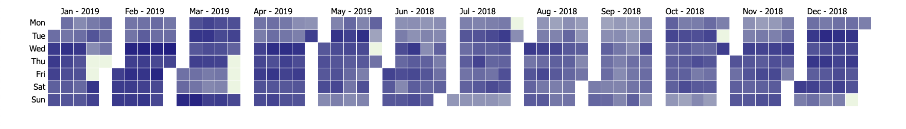
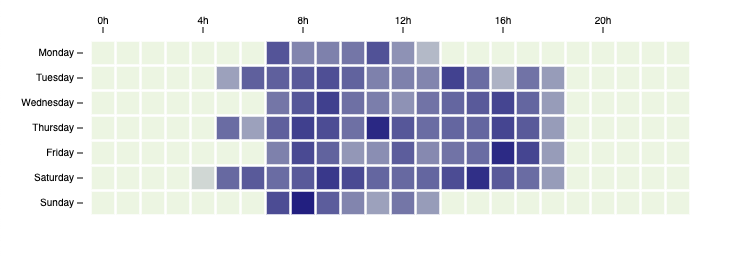

README
======

Description
-----------------

This module allows you to create nicely looking heatmap calendars with ease. You can choose between yearly, monthly and weekly format.

Preview
-----------------

#### Yearly:


#### Monthly:


#### Weekly:


Getting Started
-----------------

#### Installation

Embed the `d3-heatmap.js` as well as [d3.js](https://d3js.org/) in your HTML

```html
<script src="https://unpkg.com/d3@5.9.2/dist/d3.min.js"></script>
<script src="https://unpkg.com/@tcs-open-source/simple-d3-heatmap@latest/simple-d3-heatmap.min.js"></script>
```

#### Basic Usage

```html
<!-- Create div to append the calendar to -->
<div id="calendarContainer"></div>

<script>
	// time series data with the format `timestamp: value` as object
	const data = {
		1546254000000: 29,
		1546257600000: 41,
		1546261200000: 50,
		1546264800000: 13,
		1546268400000: 5,
	};

	// create a new instance of SimpleD3Heatmap
	const heatmap = new SimpleD3Heatmap();
	
	// create a weekly calendar which we will append to `calendarContainer` with the data `data`
	heatmap.weekly("calendarContainer", data);
</script>

<!-- Styling for the Tooltip -->
<style>
	.d3-calendar-tooltip {
		background-color: white;
		border: 2px solid #111;
		color: black;
		width: max-content;
		padding: 3px 12px;
	}

	.d3-calendar-tooltip::after {
		box-sizing: border-box;
		display: inline;
		font-size: 12px;
		width: 100%;
		line-height: 1;
		color: #111;
		content: "\25BC";
		position: absolute;
		left: 0px;
		top: 24px;
		text-align: center;
	}
</style>
```

Monthly heatmap calendar live preview: [JSFiddle Playground](https://jsfiddle.net/vwrjbaps/4/)

Documentation
-----------------

#### new SimpleD3Heatmap([settings]) 

Creates an instance of SimpleD3Heatmap.

##### Parameters

| Name | Type | Description | default | |
| ---- | ---- | ----------- | ------- | -------- |
| settings | `Object` | Object which holds all settings for the SimpleD3Heatmap | `{}` | *Optional* |
| settings.minColor | `color` | Color of the lowest datapoint in the heatmap - as HEX, RGB or CSS color code | `"#ECF5E2"` | *Optional* |
| settings.maxColor | `color` | Color of the highest datapoint in the heatmap - as HEX, RGB or CSS color code | `"#222081"` | *Optional* |
| settings.colorMode | `int` | Selects the way the colors are generated (1 => linear, 2 => sqrt or 3 => cubehelix) | `2` | *Optional* |
| settings.gutterSize | `float` | Defines the space inbetween the square (0 - 1) (not for yearly) | `0.1` | *Optional* |
| settings.outerSize | `float` | Defines the space inbetween the axis and the square (0 - 1) (not for yearly) | `0.35` | *Optional* |
| settings.scale | `float` | Defines the size of the heatmap | `1` | *Optional* |
| settings.showLines | `boolean` | Show axis lines? (not for yearly) | `false` | *Optional* |
| settings.showTicks | `boolean` | Show axis ticks? (not for yearly) | `true` | *Optional* |
| settings.locale | `String` | Locale - language used for months, weekdays and date formats | `"en-US"` | *Optional* |
| settings.dayNameLength | `String` | Defines the weekday format (long => "Friday", short => "Fri" or narrow => "F") | `"long"` | *Optional* |
| settings.showMonth | `boolean` | Show the months? | `true` | *Optional* |
| settings.tooltipClass | `String` | CSS class for the tooltip | `"d3-calendar-tooltip"` | *Optional* |
| settings.includeWeekend | `boolean` | Show saturday and sunday? Only for weekly calendar heatmap | `true` | *Optional* |
| settings.mobileViewPx | `Number` | At how many pixels (width) change to mobile view? | `1200` | *Optional* |
| settings.enableAnimations | `boolean` | Enable animations when rendering the calendar heatmaps | `true` | *Optional* |

##### Example

```javascript
const heatmap = new SimpleD3Heatmap({
	minColor: "#ECF5E2", // lowest datapoint's color in the heatmap - e.g. rgb(0, 255, 0) or #00ff00
	maxColor: "#222081", // highest datapoint's color in the heatmap - e.g. rgb(255, 255, 0) or #ffff00
	colorMode: 2, // switches between color scales (1: linear, 2: sqrt and 3: cubehelix)
	
	gutterSize: 0.1, // distance inbetween the squares (range: 0-1)
	outerSize: 0.35, // distance inbetween axis x, y and the squares
	scale: 0.8, // scale of the heatmap
	
	showLines: false, // show the axis line
	showTicks: true, // show the axis ticks
	locale: "de-DE", // defines the format of the date in the axis
	dayNameLength: "short", // style of the displayed weekday, options => long: "Friday", short: "Fri", narrow: "F" (uses locale)
	showMonth: true, // displays the months (uses locale)
})
```

##### Returns
- `Void`


#### SimpleD3Heatmap.weekly(container_id, data) 

Creates a heatmap calendar of one week

##### Parameters

| Name | Type | Description | |
| ---- | ---- | ----------- | -------- |
| container_id | `String` | ID of the container where the heatmap should be appended to | &nbsp; |
| data | `heatmapData` | Data for the heatmap | &nbsp; |

##### Returns
- `Void`


#### SimpleD3Heatmap.monthly(container_id, data) 

Creates a heatmap calendar of one month

##### Parameters

| Name | Type | Description | |
| ---- | ---- | ----------- | -------- |
| container_id | `String` | ID of the container where the heatmap should be appended to | &nbsp; |
| data | `heatmapData` | Data for the heatmap | &nbsp; |

##### Returns
- `Void`


#### SimpleD3Heatmap.yearly(container_id, data) 

Creates a heatmap calendar of one year

##### Parameters

| Name | Type | Description | |
| ---- | ---- | ----------- | -------- |
| container_id | `String` | ID of the container where the heatmap should be appended to | &nbsp; |
| data | `heatmapData` | Data for the heatmap | &nbsp; |

##### Returns
- `Void`


#### Data Format: heatmapData

```js
{
	timestamp: value,
	...
}
```
